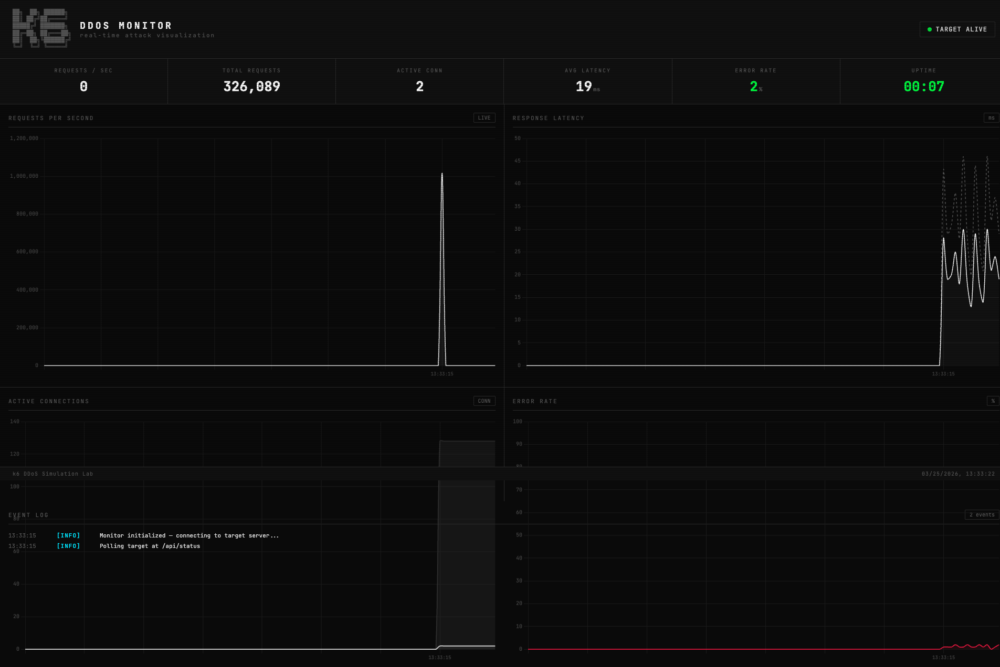
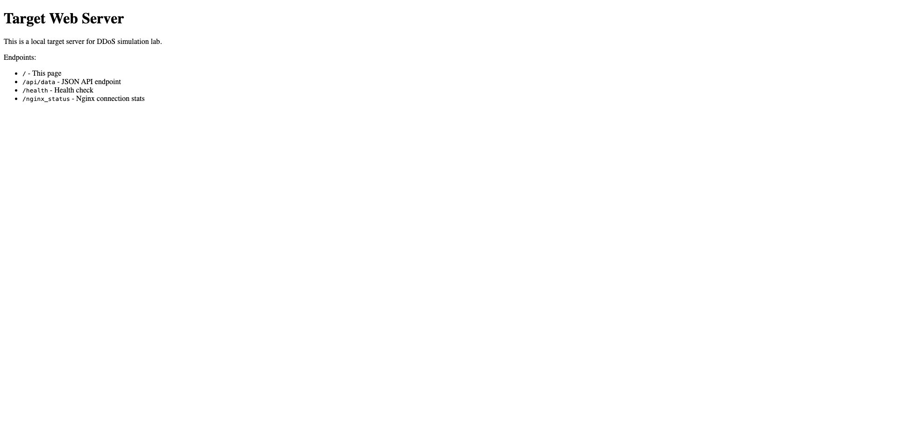
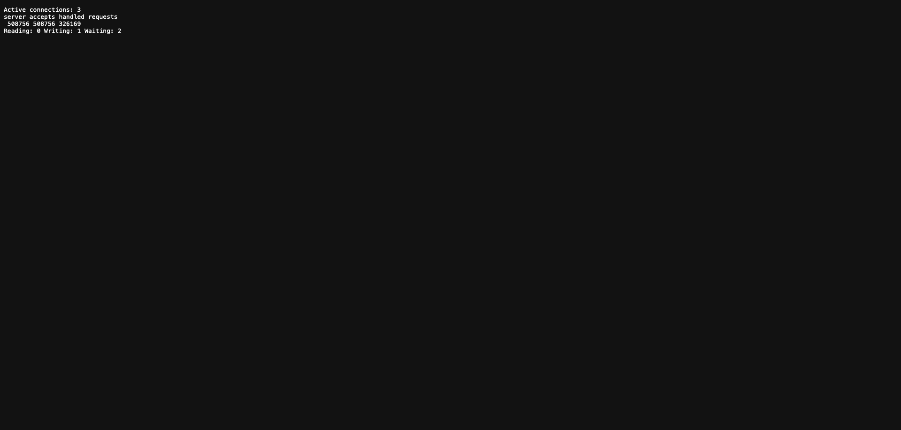

# k6 DDoS Simulation Lab

A Docker-based local DDoS simulation environment for cybersecurity education. Includes a real-time hacker-style monitoring dashboard, multiple attack scripts, and a resource-limited target server.

> **Warning**: This lab is for educational purposes only. Only use against your own local infrastructure.

## Screenshots

### Real-Time Monitor Dashboard


### Target Web Server


### Nginx Status (Live Connections)


## Architecture

```
┌──────────────┐     ┌──────────────┐     ┌──────────────┐
│   k6 Attacker│────>│  Squid Proxy │────>│ Nginx Target │
│   (5000 VUs) │     │  :3128       │     │ :8080        │
└──────────────┘     └──────────────┘     └──────┬───────┘
                                                  │
                                          ┌───────┴───────┐
                                          │   Monitor      │
                                          │   :4000        │
                                          └───────────────┘
```

| Container | Role | Port | Limits |
|-----------|------|------|--------|
| `ddos-target` | Nginx victim server | `8080` | 0.25 CPU, 64MB RAM, 128 max connections |
| `ddos-proxy` | Squid forward proxy | `3128` | - |
| `ddos-monitor` | Real-time dashboard | `4000` | - |
| `ddos-k6` | k6 attacker | - | On-demand |

## Attack Scripts

| Script | Method | Peak | Duration |
|--------|--------|------|----------|
| `http_flood` | HTTP GET/POST batch flood, 5 requests per iteration | 5,000 req/s, 8,000 VUs | ~75s |
| `slowloris` | Hold open connections to exhaust server pool | 5,000 VUs | ~85s |
| `multi_proxy` | Distributed flood with spoofed IPs + random User-Agents | 5,000 req/s, 8,000 VUs | ~75s |

## Quick Start

```bash
# 1. Start the lab
./run.sh up

# 2. Open the monitor dashboard
open http://localhost:4000

# 3. Launch an attack
./run.sh attack http_flood
./run.sh attack slowloris
./run.sh attack multi_proxy

# 4. Check if target survived
./run.sh status

# 5. Clean up
./run.sh down
```

## Requirements

- Docker & Docker Compose

## Monitor Features

- CRT scanline overlay
- Live stats: RPS, Total Requests, Active Connections, Latency, Error Rate, Uptime
- 4 real-time charts with 500ms polling
- Color-coded status: `TARGET ALIVE` / `UNDER ATTACK` / `TARGET DOWN`
- Event log with `[ATTACK]` `[WARN]` `[ERROR]` `[INFO]` tags

## License

For educational use only.
